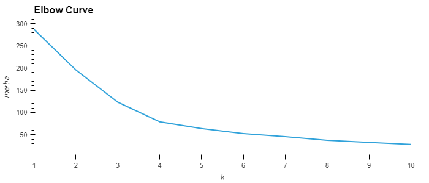
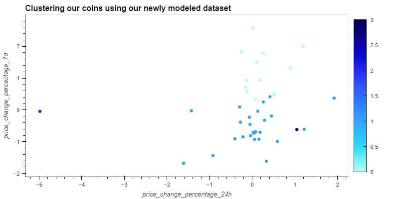

# crypto_kmeans
Using k-means to cluster a potential crypto portfolio for optimization.

## Technologies

In this project we are utilizing Python 3, Jupyter Lab, Pandas, scikit learn and hvplot.   

Pandas library -- Incredibly useful Python library for data science and data analysis  
Jupyter Lab -- Robust environment to be able to view and edit devopment projects in a streamlined system.  
hvPlot -- A high-level plotting API for the PyData ecosystem built on HoloViews.
scikit learn -- a free software machine learning library for the Python programming language.

---

## Installation Guide

* Pandas -- The source code is currently hosted on GitHub at: https://github.com/pandas-dev/pandas

Binary installers for the latest released version are available at the Python Package Index (PyPI) and on Conda.

### conda
`conda install pandas`
### or PyPI
`pip install pandas`

* Jupyter Lab -- 
    [Link for detailed instructions on installing Jupyter Lab here.](https://jupyter.org/install)  
    
*  The PyViz Ecosystem (visualization package that includes hvPlot)  

### conda
`conda install -c pyviz hvplot`
### or PyPI
`pip install pyviz`  

**For more detailed information on pyviz installation and other features, please reference the [pyviz website](https://pyviz.org/)
 

*  scikit learn --  
    [Click here for link to their homepage for detailed installation instructions and other documentation](https://scikit-learn.org/stable/) 
    
---
## Dependencies:  

import pandas as pd
import hvplot.pandas
from pathlib import Path
from sklearn.cluster import KMeans
from sklearn.decomposition import PCA
from sklearn.preprocessing import StandardScaler

## Usage

### We start by finding the optimal number of clusters(k) for our data using the KMeans method from scikit learn and analyzing our 'elbow plot'  

```python  
for i in k:
    model = KMeans(n_clusters=i, random_state=1)
    model.fit(df_market_data_scaled)
    inertia.append(model.inertia_)  
```  
*Above we fit the model to iterate over a pre-defined range for i (1 to 11), and then append the inertia values to a list for plotting our elbow curve  

```python  
df_elbow.hvplot.line(x='k', y='inertia', xticks=k, title='Elbow Curve')  
```  
  

*Notice the plot above shows the 'elbow' indicates the optimal value for k or the number of clusters is 4  


### Once we have determined the optimal number of clusters for our dataset, we can plot a scatter plot of the new dataframe generated after using our model to group our scaled dataframe into their predicted clusters  --  



  
### We will use our original scaled dataframe to implement our PCA analyses  

```python
pca = PCA(n_components=3)  
pca_market_df = pd.DataFrame(pca.fit_transform(df_market_data_scaled))  
pca.explained_variance_ratio_  
```  
*From our code block above we reduce the components in our dataset to 3, and then calculate the explained variance ratio that generates this array -- array([0.3719856 , 0.34700813, 0.17603793]) -- this tells us that approx. 89.5% of our variance can be explained by these 3 components.


## License

Licensed under the [MIT License](https://github.com/git/git-scm.com/blob/main/MIT-LICENSE.txt)  Copyright 2021 Dave Thomas.


